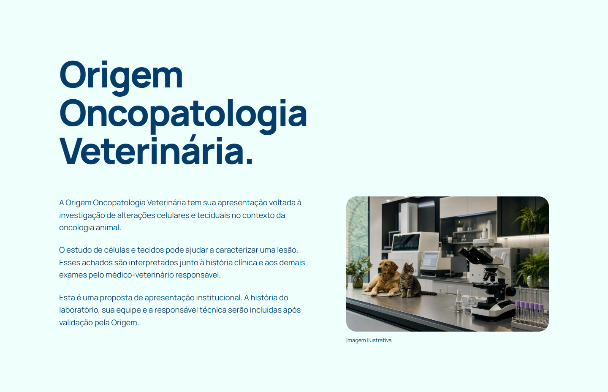
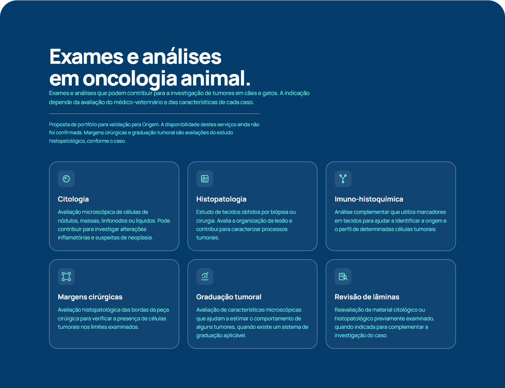


# Origem Oncopatologia Veterinária

Landing page institucional da **Origem Oncopatologia Veterinária** — apresentação voltada à investigação de alterações celulares e teciduais no contexto da oncologia animal.

Site estático em HTML, CSS e JavaScript, com design focado em clareza e confiança para o público de médicos-veterinários.

## Screenshots

### Desktop






### Mobile



## Seções do site

- **Investigação tumoral** — como citologia, histopatologia e avaliações complementares contribuem para o diagnóstico veterinário.
- **Exames e análises** — portfólio proposto: citologia, histopatologia, imuno-histoquímica, margens cirúrgicas, graduação tumoral e revisão de lâminas.
- **Como funciona** — roteiro de orientação: consulta inicial, preparo e envio, avaliação do material, laudo e acompanhamento.
- **Para a rotina clínica** — pontos para esclarecer com o laboratório antes de solicitar uma análise.
- **Contato** — canais de atendimento (a confirmar pelo laboratório).

> Observação: esta é uma proposta de apresentação institucional. Conteúdos como portfólio de exames, histórico do laboratório e canais de contato aguardam validação pela Origem.

## Tecnologias

- HTML5 semântico
- CSS3 com *design tokens* (paleta, tipografia e espaçamentos via variáveis CSS) e layout responsivo
- JavaScript vanilla (menu mobile, animações de *reveal* e melhorias de interação)
- Fontes via Google Fonts: **Instrument Serif** e **Manrope**
- Favicons e logotipos em SVG (pasta `assets/`)

## Como rodar localmente

Sendo um site estático, basta servir os arquivos — não há build nem dependências.

```bash
# Opção simples
python -m http.server 8000
# abra http://localhost:8000

# Ou abra index.html diretamente no navegador
```

## Estrutura

```
.
├── assets/                  # imagens, logotipos e favicons usados no site
├── screenshots/             # capturas para o README
├── index.html               # página principal (todo o conteúdo marcado)
├── origem.css               # estilos do site
├── origem.js                # interações (menu mobile, reveal, etc.)
├── paleta.css               # design tokens / variáveis de cor
└── paleta_de_cores_v3.txt   # referência de cores usadas no projeto
```

## Deploy

Projeto serve no Netlify. Para publicar uma nova versão, basta enviar a pasta para o provedor de hospedagem (build command: nenhum; publish directory: raiz do projeto).

## Licença

Uso interno / institucional. Direitos reservados à Origem Oncopatologia Veterinária.

## Autor

[Victor Hugo Corrêa](https://www.linkedin.com/in/victor-hn-correa)